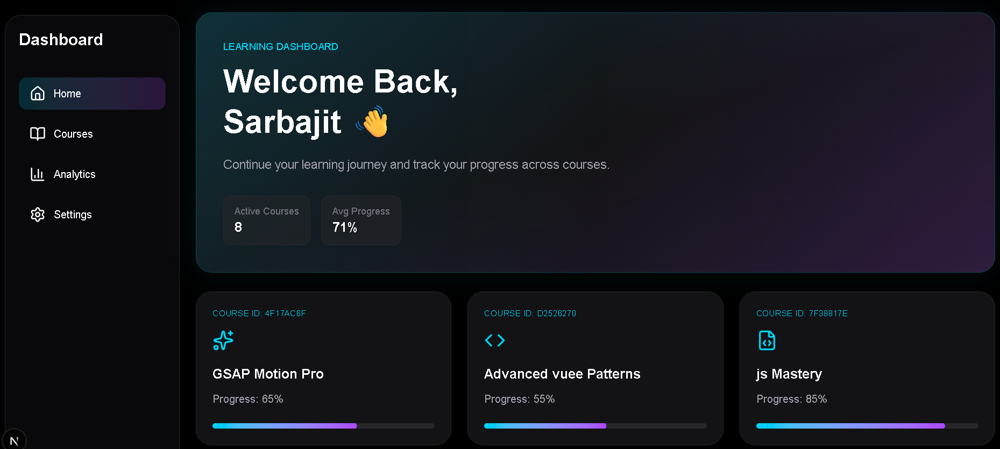
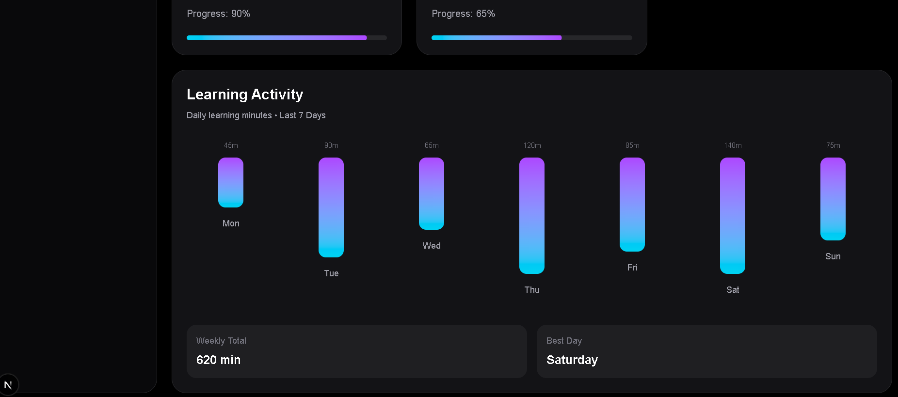

# Learning Dashboard

A responsive learning dashboard built with **Next.js App Router**, **Supabase**, **Tailwind CSS**, and **Framer Motion**.

The application displays learning progress through a modern Bento-style dashboard, animated UI components, and a dedicated Courses page powered by live data from Supabase.

---

## Live Demo

👉 [Live Demo](https://dashboard-9c606ia5t-sarbajitacharjees-projects.vercel.app/)


## Features

* Responsive Bento Dashboard Layout
* Supabase Data Integration
* Dedicated Courses Page
* Mobile Hamburger Navigation
* Framer Motion Animations
* Hover Micro-Interactions
* Loading States
* Error Handling
* Server-Side Data Fetching
* Modern Glassmorphism UI

---

## Tech Stack

* Next.js 16 (App Router)
* TypeScript
* Tailwind CSS
* Supabase
* Framer Motion
* Lucide React


<p align="center">


</p>

<p align="center">


</p>

---

## 📸 Project Preview




## 📸 Project Preview




## Environment Variables

Create a `.env.local` file in the root of the project:

```env
NEXT_PUBLIC_SUPABASE_URL=your_supabase_project_url

NEXT_PUBLIC_SUPABASE_ANON_KEY=your_supabase_anon_key
```

A sample configuration is provided in `.env.example`.

---

## Installation

Install dependencies:

```bash
npm install
```

Run the development server:

```bash
npm run dev
```

Open:

```txt
http://localhost:3000
```

---

## Project Structure

```txt
app/
│
├── page.tsx
├── loading.tsx
├── error.tsx
│
├── courses/
│   └── page.tsx
│
components/
│
├── Sidebar.tsx
├── HeroTile.tsx
├── CourseCard.tsx
├── ActivityTile.tsx
│
lib/
│
├── supabase.ts
├── icons.ts
│
public/
```

---

# Architectural Choices

The application follows the Next.js App Router architecture and separates concerns between data fetching, presentation, and interactivity.

### Data Layer

Supabase is used as the primary data source.

The `courses` table stores:

* Course Title
* Progress
* Icon Reference
* Creation Date

Dashboard content is fetched directly from Supabase and rendered dynamically.

---

### Component Architecture

The UI is split into reusable components:

* HeroTile
* CourseCard
* ActivityTile
* Sidebar

This makes the dashboard easier to maintain and scale while keeping responsibilities clearly separated.

---

### Responsive Design Strategy

The application uses Tailwind CSS responsive utilities.

Navigation adapts based on screen size:

#### Desktop

* Full Sidebar Navigation

#### Tablet

* Compact Sidebar

#### Mobile

* Hamburger Menu Drawer

This ensures usability across devices without maintaining separate layouts.

---

# Server and Client Component Split

A key architectural decision was determining which components should remain Server Components and which should become Client Components.

---

## Server Components

Pages responsible for data fetching are implemented as Server Components.

Examples:

```txt
app/page.tsx

app/courses/page.tsx
```

Reasons:

* Secure data fetching
* Reduced client-side JavaScript
* Better performance
* Faster initial page load
* Improved scalability

Supabase queries are executed on the server and data is passed to UI components.

---

## Client Components

Interactive UI elements use `"use client"`.

Examples:

* Sidebar
* HeroTile
* CourseCard
* ActivityTile

Reasons:

* Framer Motion animations
* Hover effects
* Mobile menu state
* Navigation interactions

These components require browser-side interactivity and therefore must be rendered on the client.

---

# Animation Strategy

The project uses Framer Motion to create polished interactions while maintaining performance.

Implemented interactions include:

### Staggered Entrance Animations

Dashboard tiles animate into view using:

* Opacity
* TranslateY

This creates a smooth sequential loading experience.

---

### Hover States

Dashboard cards:

* Scale up slightly (~2%)
* Reveal subtle glow effects
* Display gradient hover states

Spring-based motion is used:

```ts
type: "spring",
stiffness: 300,
damping: 20
```

This produces natural, non-linear motion.

---

### Sidebar Micro-Interactions

The active navigation item uses Framer Motion's:

```tsx
layoutId
```

feature to create a snapping highlight effect between navigation items.

This satisfies the micro-interaction requirement while keeping the implementation lightweight.

---

### Performance Considerations

To avoid layout shifts:

Animations primarily use:

* transform
* opacity

instead of animating layout-affecting properties such as:

* width
* height
* margin
* padding

This results in smoother rendering and reduced browser reflow.

---

# Challenges Faced

## Supabase Integration

Initially the application connected successfully to Supabase but returned an empty dataset.

The issue was traced to Row Level Security (RLS) configuration and was resolved by creating the appropriate read policy.

---

## Responsive Navigation

Designing a navigation system that worked across desktop, tablet, and mobile devices required multiple iterations.

The final implementation uses:

* Sidebar Navigation (Desktop)
* Compact Navigation (Tablet)
* Hamburger Drawer (Mobile)

for a consistent user experience.

---

## Balancing Server and Client Rendering

Several components required Framer Motion animations while data fetching needed to remain on the server.

The solution was to:

* Fetch data in Server Components
* Pass data into Client Components
* Keep animation logic isolated within presentation components

This maintained performance while enabling rich interactions.

---

# Future Improvements

Potential enhancements include:

* Authentication
* User Profiles
* Real Learning Analytics
* Course Completion Tracking
* Dark / Light Theme Toggle
* Advanced Dashboard Metrics
* Real-Time Supabase Updates

---

# Deployment

The project is ready for deployment on Vercel.

Required environment variables:

```env
NEXT_PUBLIC_SUPABASE_URL

NEXT_PUBLIC_SUPABASE_ANON_KEY
```

---

# Author

Sarbajit Acharjee

Frontend Developer | React | Next.js | TypeScript
